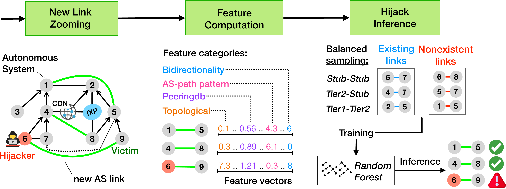

# Introduction

**DFOH (Detection of Forged-Origin Hijacks)** is a system that aims to detect forged-origin hijacks on the whole Internet. 
A **forged-origin hijack** is a type of BGP routing attack in which the attacker announces a prefix but prepends the legitimate origin AS to the AS-path. This technique allows the attacker to bypass security mechanisms such as [RPKI](https://datatracker.ietf.org/doc/html/rfc8210). As a result, conventional BGP hijack detectors are often unable to detect these attacks.

**DFOH** is useful given that the BGP extensions proposed to cryptographically verify the validity of the AS paths (such as BGPSec or ASPA) are hard to widely deploy. With DFOH, operators can quickly and with high confidence know when their IP prefixes are being hijacked.

---

# How it works

DFOH detects forged-origin hijacks by leveraging a key property:  
**a forged-origin hijack introduces a new AS link in the Internet topology.**

The main goal of DFOH is to determine whether a newly observed AS link is legitimate or potentially malicious. To achieve this, DFOH relies on probabilistic inferences (using relatively simple ML algorithms). Because of its probabilistic nature, flagged cases may also include **false positives** or result from **misconfigurations** rather than malicious intent.

DFOH follows a three-step approach, illustrated in the figure below:

1. **Detection of new AS links**  
   DFOH parses the AS paths of BGP routes collected from [bgproutes.io](https://bgproutes.io/) to identify new AS links. A forged-origin hijack often introduces a new AS link between the victim and the attacker (in the case of a Type-1 hijack).  
   However, most new AS links are caused by legitimate events such as new peering agreements. The next steps focus on distinguishing fake AS links from legitimate ones.  

2. **Feature extraction**  
   For each newly detected AS link, DFOH computes a set of features grouped into four categories: **topological**, **AS-path pattern**, **peering**, and **bidirectionality**. This feature set is carefully designed to ensure accuracy across various attack scenarios and robustness against adversarial inputs.  

3. **Inference pipeline**  
   DFOH employs an inference pipeline inspired by state-of-the-art link prediction frameworks. Its training phase, however, relies on a balanced sampling algorithm that mitigates routing biases and prevents overfitting to any particular attack scenario.  

<figure style="width:700px; margin-left:1rem; text-align:center;">
  
  <figcaption style="font-size:.85em; color:#6b7280; margin-top:.35rem;">
    Figure 1 — The DFOH inference pipeline.
  </figcaption>
</figure>

With the current setup, the DFOH inference algorithm achieves an accuracy of **95–96%**.
For a detailed description of how the algorithms work and how it performs more precisely, you can read our [paper](https://cristel.pelsser.eu/pdf/holterbach-2024.pdf) or watch our [presentation](https://www.youtube.com/watch?v=-L-WcmE5cjo&t=3473s).

---

# How to Use DFOH

DFOH publishes updates **hourly**, providing the list of newly detected AS links together with:

* Inference results (legitimate, suspicious, or malicious),
* Confidence level,
* List of potential victims, and
* Other contextual information.

By default, links involving private ASNs are hidden (an option is available to include them). If the same new link is observed multiple times within 24 hours, it is reported only once. The reference set of existing links is refreshed every 24 hours, excluding any links from the last 30 days that were already flagged as potentially malicious.

You can access DFOH data in two ways:

1. Through the **web interface**, or
2. Through the **API**.

Both methods are described below.

---

## Accessing DFOH Inferences via the API

The API is available at **[https://dfoh-api.bgproutes.io](https://dfoh-api.bgproutes.io)** and provides two main endpoints:

* `*/new_links*` – returns summaries of newly observed AS links.
* `*/inference_details*` – returns detailed information for specific cases.

---

### `/new_links` endpoint

This endpoint returns the list of new links along with:

* Inference result and confidence,
* List of potential victims,
* Number of observed AS-paths,
* First-seen timestamp, and
* A unique identifier for the case.

#### Parameters

| Parameter          | Type      | Description                                                                        | Example                          |
| ------------------ | --------- | ---------------------------------------------------------------------------------- | -------------------------------- |
| `asn`              | list[int] | Return links where at least one ASN is involved. Comma-separated.                  | `asn=3356,2914`                  |
| `attackers`        | list[int] | Return links where the attacker ASN matches one in the list. Comma-separated.      | `attackers=64512,64513`          |
| `victims`          | list[int] | Return links where the victim ASN matches one in the list. Comma-separated.        | `victims=13335`                  |
| `inference_result` | string    | Filter by inference result. Valid values: `legitimate`, `suspicious`, `malicious`. | `inference_result=suspicious`    |
| `nb_max_aspaths`   | int       | Return links with fewer AS-paths than this value.                                  | `nb_max_aspaths=10`              |
| `nb_min_aspaths`   | int       | Return links with more AS-paths than this value.                                   | `nb_min_aspaths=5`               |
| `start_date`       | datetime  | Only return links first seen after this date (ISO format).                         | `start_date=2025-09-01T00:00:00` |
| `stop_date`        | datetime  | Only return links first seen before this date (ISO format).                        | `stop_date=2025-09-15T23:59:59`  |

#### Example request

```bash
curl https://dfoh-api.bgproutes.io/new_links
```

#### Example response (truncated)

```json
{
  "code": 200,
  "results": [
    {
      "id": 150,
      "date": "2025-09-27T11:59:16",
      "as1": 3303,
      "as2": 45204,
      "presumed_attacker": [3303],
      "presumed_victims": [24320, 152337, 45204, 13335],
      "inference_result": "legitimate",
      "confidence_level": 0,
      "nb_vps_observed": 43,
      "nb_affected_prefixes": 328,
      "nb_aspaths_observed": 602,
      "is_reccurent": false
    },
    {
      "id": 372,
      "date": "2025-09-27T11:54:23",
      "as1": 51776,
      "as2": 21497,
      "presumed_attacker": [51776],
      "presumed_victims": [43309],
      "inference_result": "suspicious",
      "confidence_level": 5,
      "nb_vps_observed": 1,
      "nb_affected_prefixes": 1,
      "nb_aspaths_observed": 1,
      "is_reccurent": false
    }
  ]
}
```

---

### `/inference_details` endpoint

Use this endpoint to obtain detailed information about specific cases. It requires one or more unique identifiers returned by `/new_links`.

#### Parameters

| Parameter      | Type      | Description                                                     | Example              |
| -------------- | --------- | --------------------------------------------------------------- | -------------------- |
| `new_link_ids` | list[int] | Comma-separated list of new link IDs to fetch detailed results. | `new_link_ids=11,42` |

#### Example request

```bash
curl "https://dfoh-api.bgproutes.io/inference_details?new_link_ids=11"
```

#### Example response

```json
{
  "code": 200,
  "results": {
    "11": [
      [
        "2025-09-27T11:00:46",
        65001,
        2200,
        65001,
        "37.49.234.72",
        "65001 2200 201659",
        "2a02:7ae0::/32",
        "suspicious",
        5,
        [],
        []
      ],
      [
        "2025-09-27T11:00:46",
        65001,
        2200,
        65001,
        "37.49.234.72",
        "65001 2200 781",
        "2a0c:1100::/32",
        "suspicious",
        5,
        [],
        []
      ]
    ]
  }
}
```

---

### Running Your Own API

You can run your own DFOH instance and API. The source code and setup instructions are available on [GitHub](https://github.com/bgproutes-io/forged_origin_hijacks_detection/tree/main).

---

## Accessing DFOH Inferences via the Web Interface

The web interface is available at **[https://dfoh.uclouvain.be/](https://dfoh.uclouvain.be/)**. It fetches data directly from the API and provides an interactive view.

* The **New Links** page shows all links detected in the last two hours (excluding private ASNs by default).
* Each entry includes a summary and a button to view detailed information.
* Users can adjust filters (e.g., date range, inclusion of private ASNs).

### Running Your Own Web Interface

The web interface is also open source. The code and setup instructions can be found on [GitHub](https://github.com/bgproutes-io/forged_origin_hijacks_detection/tree/main).

---

## Providing Feedback on DFOH Inferences

If you are a potential victim of a reported link, you can provide feedback via the **web interface** (not the API).

* Sign in using your **PeeringDB account**.
* Your account will be associated with the ASNs you operate according to PeeringDB.
* Visit the [Your Cases](http://localhost:3000/your_cases) page to view all links involving your ASN over the past 30 days.
* For each case, you can submit feedback indicating whether the flagged link was legitimate or not.

---

## Contributors

### Research
The research work behind DFOH was carried out by:  
- **Thomas Holterbach**, University of Strasbourg — tholterbach@unistra.fr  
- **Thomas Alfroy**, University of Strasbourg — thomas.alfroy@etu.unistra.fr  
- **Amreesh D. Phokeer**, Internet Society — phokeer@isoc.org  
- **Alberto Dainotti**, Georgia Tech — dainotti@gatech.edu  
- **Cristel Pelsser**, UCLouvain — cristel.pelsser@uclouvain.be  

### Development
The source code of DFOH and its dashboard was developed by:  
- **Thomas Alfroy**, University of Strasbourg — thomas.alfroy@etu.unistra.fr  
- **Thomas Holterbach**, University of Strasbourg — tholterbach@unistra.fr  
- **Olivier Bemba**, internship at the University of Strasbourg (May–August 2025) — obemba3@gatech.edu  

---

## Funding

The research work behind DFOH was possible thanks to the following funding:

- Thomas Holterbach was partially funded by the Internet Society (through the MANRS Initiative) and by Région Grand Est.
- Thomas Alfroy was funded by ArtIC project "Artificial Intelligence for Care" (grant ANR-20-THIA-0006-01) and co funded by Région Grand Est, Inria Nancy - Grand Est, IHU of Strasbourg, University of Strasbourg and University of Haute-Alsace.
- This research project has been made possible in part by a grant from the Cisco University Research Program Fund, an advised fund of Silicon Valley Foundation.

The code for DFOH's API and this dashboard is funded through [NGI Zero Core](https://nlnet.nl/core), a fund established by [NLnet](https://nlnet.nl) with financial support from the European Commission's [Next Generation Internet](https://ngi.eu) program. Learn more at the [NLnet project page](https://nlnet.nl/project/BGP-ForgedOrigin).

[](https://nlnet.nl)[](https://nlnet.nl/core)
---
